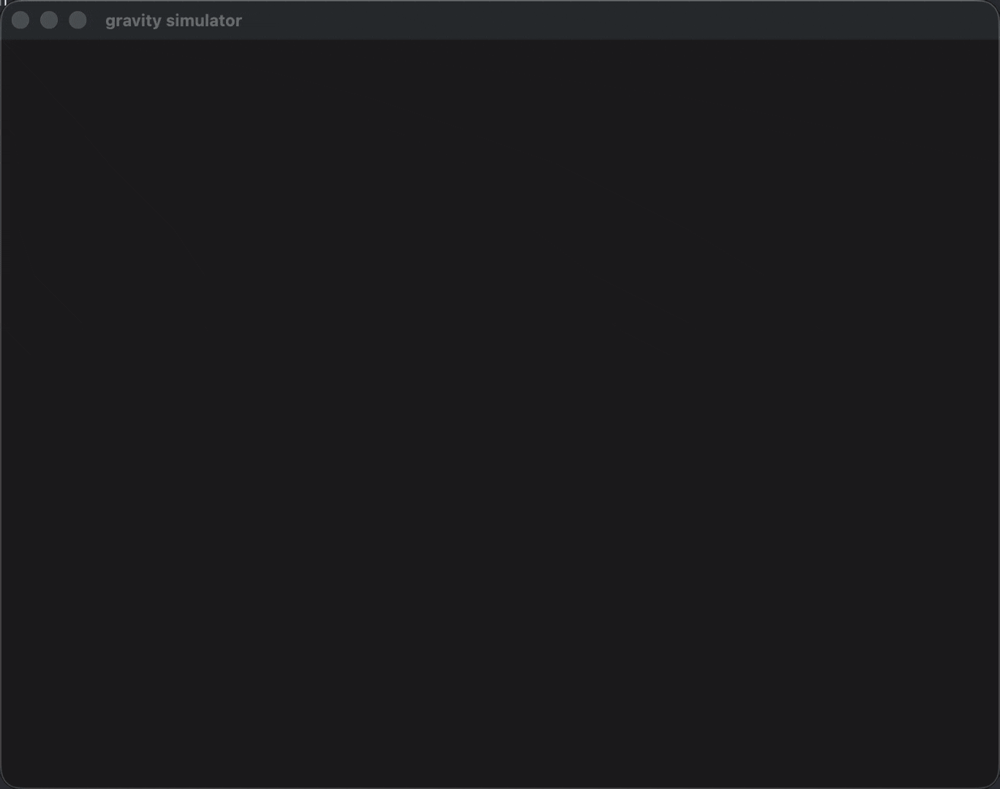
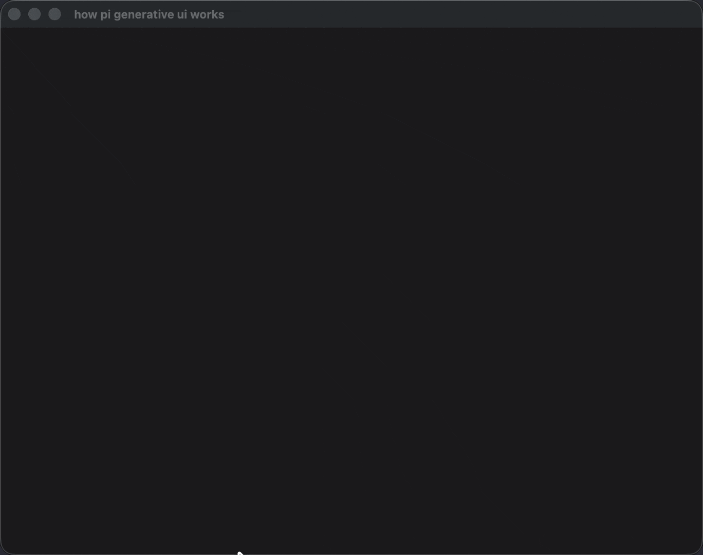

# pi-generative-ui

Claude.ai's generative UI, rebuilt for [pi](https://github.com/badlogic/pi-mono), with the original Pi streaming path preserved and a new sessionized Hermes-facing architecture extracted alongside it.

Ask pi to "show me how compound interest works" and get a live interactive widget - sliders, charts, animations - rendered in a Glimpse window on macOS or Linux/WSL. Not a screenshot. Not a code block. A real HTML application with JavaScript, rendered in a browser-backed window.

  

## What changed

This repo now has two layers:

- **Pi compatibility path**: keeps the original `visualize_read_me` + streamed `show_widget` workflow for pi.
- **Sessionized GenUI path**: exposes the same renderer/runtime as shared TypeScript code plus a minimal MCP-oriented widget lifecycle for Hermes-style integrations.

That means the renderer was **not** rewritten. The working browser-backed runtime was extracted and reused.

## Architecture

### 1. `genui-core`

Shared TypeScript runtime for generative UI, independent from Pi registration hooks.

It owns:
- WSL/backend resolution
- Glimpse loading
- HTML/SVG shell generation
- morphdom patch path
- widget open / patch / close lifecycle
- session-scoped widget registry
- buffered widget event delivery
- compatibility helpers for Pi-style `show_widget`

### 2. `hermes-genui-mcp`

A minimal session-based MCP-facing service layer over `genui-core`.

Public tool surface:
- `visualize_read_me`
- `open_widget`
- `patch_widget`
- `close_widget`
- `widget_event_poll`

Resources and prompts stay off by default.

### 3. `hermes-genui-plugin`

Thin Hermes session glue.

It only handles:
- bundled `SKILL.md`
- ephemeral context injection before LLM calls
- session tracking for `visualize_read_me`
- orphan cleanup on session end

It does **not** contain renderer logic.

### 4. Pi extension wrapper

`.pi/extensions/generative-ui/index.ts` remains the Pi-specific entrypoint. It now delegates runtime behavior to `genui-core` while preserving the original Pi streaming UX.

## Pi streaming path

The Pi extension still supports the original streaming experience:

1. `visualize_read_me`
2. `show_widget`
3. streaming interception of `toolcall_start` / `toolcall_delta` / `toolcall_end`
4. early shell open in Glimpse
5. morphdom patching as content arrives
6. final script execution when the widget completes

So the repo now supports both:
- **Pi live streaming widgets**, and
- **sessionized lifecycle-driven widgets for Hermes/MCP**

## Install

```bash
pi install git:github.com/Michaelliv/pi-generative-ui
```

> macOS and Linux/WSL are supported through Glimpse.
>
> **macOS:** uses WKWebView and requires the Swift toolchain.
>
> **WSL/Linux:** requires Node 18+, GUI support, and a Glimpse-supported browser backend. On WSL, the runtime defaults `GLIMPSE_BACKEND=chromium` unless you already set it.

## Running in WSL

Use the extension from inside your WSL Linux environment, not from Windows PowerShell.

### Requirements

- WSL2
- WSLg enabled so Linux GUI apps can open windows
- Node.js 18+
- pi installed in the Linux environment
- a Chromium-based browser visible from Linux

### Setup inside WSL

```bash
uname -a
node --version
which chromium || which google-chrome || which google-chrome-stable
```

If browser auto-detection fails, point Glimpse at a specific executable:

```bash
export GLIMPSE_CHROME_PATH=/usr/bin/chromium
```

### Install inside WSL

```bash
npm install
pi install git:github.com/Michaelliv/pi-generative-ui
```

### Backend setup on WSL

```bash
export GLIMPSE_BACKEND=chromium
```

Persist it if you want:

```bash
echo 'export GLIMPSE_BACKEND=chromium' >> ~/.bashrc
```

### Test in WSL

```bash
npm test
```

## Usage

### In pi

Ask pi to visualize something:

- `Show me how compound interest works`
- `Visualize the architecture of a transformer`
- `Create a dashboard for this data`
- `Draw a particle system`

The extension adds two tools that the LLM calls automatically:
- `visualize_read_me`
- `show_widget`

### In Hermes / MCP-style integrations

Drive the sessionized lifecycle directly:

1. `visualize_read_me`
2. `open_widget`
3. `patch_widget`
4. `widget_event_poll` when needed
5. `close_widget`

This path intentionally does **not** depend on token-by-token partial tool-argument interception.

## Project structure

```text
pi-generative-ui/
├── .pi/extensions/generative-ui/
│   ├── index.ts
│   ├── guidelines.ts
│   ├── svg-styles.ts
│   └── claude-guidelines/
├── packages/
│   ├── genui-core/
│   │   └── src/
│   │       ├── index.ts
│   │       ├── platform.ts
│   │       ├── runtime.ts
│   │       ├── shell.ts
│   │       ├── types.ts
│   │       ├── guidelines.ts
│   │       └── svg-styles.ts
│   ├── hermes-genui-mcp/
│   │   └── src/index.ts
│   └── hermes-genui-plugin/
│       ├── SKILL.md
│       └── src/index.ts
├── tests/
│   ├── unit/
│   ├── integration/
│   └── fixtures/golden/
└── package.json
```

## Tests

The repo now includes regression coverage for:
- Pi-independent `genui-core`
- shell + morphdom behavior
- WSL backend resolution
- sessionized MCP tool surface
- widget lifecycle open / patch / close
- widget event polling
- Hermes plugin skill + cleanup behavior

Run them with:

```bash
npm test
```

## Credits

- [pi](https://github.com/badlogic/pi-mono)
- [Glimpse](https://github.com/hazat/glimpse)
- [morphdom](https://github.com/patrick-steele-idem/morphdom)
- Anthropic

## License

MIT
